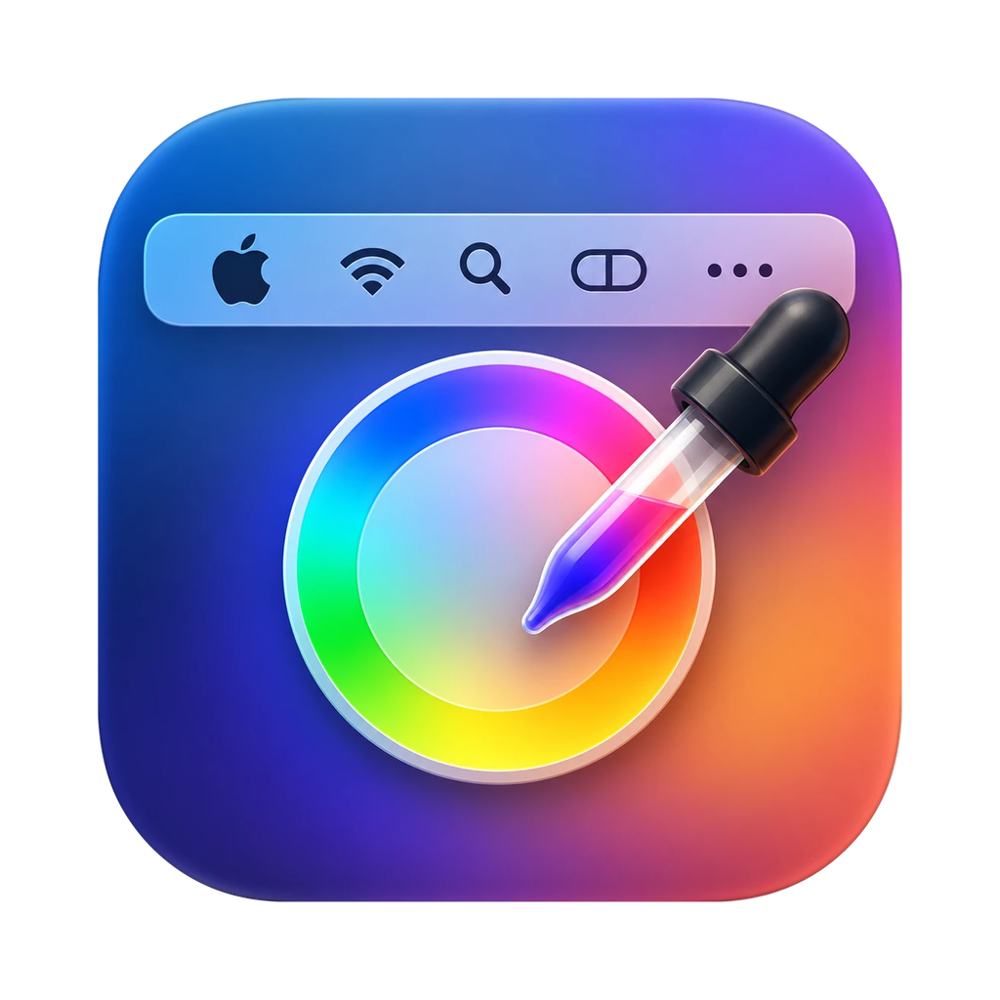

<a id="top"></a>

<p align="center">
  
</p>

<h1 align="center">MenuTint</h1>

<p align="center">
  <strong>Paint the macOS menu bar any color you like.</strong>
</p>

<p align="center">
  A small menu bar app that recolors the white icons and text in your menu bar (clock, Wi‑Fi, battery, app menus, third-party icons…) with the color you choose.<br>
  An 84-color palette, hex codes, an advanced color picker, and a flowing rainbow mode, all in one menu.
</p>

<p align="center">
  
  
  
</p>

<p align="center">
  <a href="https://github.com/akwnnwastaken/menutint/releases/latest/download/MenuTint.zip"><strong>Download for macOS</strong></a>
  &nbsp;·&nbsp;
  <a href="#installation"><strong>Installation</strong></a>
  &nbsp;·&nbsp;
  <a href="#build-from-source"><strong>Build from source</strong></a>
</p>

---

MenuTint lives in the menu bar as a palette icon. Click it to open a menu with the color palette, rainbow mode, and settings. The color you pick is applied immediately.

## Features

- **84-color palette:** Applied the moment you click; the menu stays open so you can try colors quickly.
- **Hex color entry:** Accepts `#FF8800`, `FF8800`, and `#F80`, with a live preview while you type.
- **Advanced color picker:** The macOS color wheel, sliders, and eyedropper.
- **Recent colors:** Colors you entered as a code or picked with the advanced picker.
- **Rainbow mode:** A flowing color gradient across the menu bar, with 11 styles (Classic, Pastel, Deep, Neon, Dark Purple, Sunset, Ocean, Forest, Fire, Aurora, Candy) and speed and direction controls.
- **Intensity:** How strongly the color is applied.
- **Sensitivity:** The higher it is, the more dim or gray items get painted too.
- **Multiple displays:** Several displays are supported.
- **Launch at login:** Starts automatically when your Mac starts.
- **Normal interaction:** Clicks are not affected, and menus work as usual.

## Downloads

Current release: **v1.0.0**.

| Platform | Package | Download | Release notes |
| --- | --- | --- | --- |
| macOS 13+ · Apple Silicon and Intel | `MenuTint.zip` | [Download ZIP](https://github.com/akwnnwastaken/menutint/releases/latest/download/MenuTint.zip) | [`v1.0.0`](https://github.com/akwnnwastaken/menutint/releases/tag/v1.0.0) |

> [!NOTE]
> The app is distributed unsigned, so Gatekeeper warns you the first time you open it. Follow the steps in [Installation](#installation).

---

## How does it work?

macOS has no public API for changing the color of other apps' menu bar icons. So MenuTint:

1. Captures the menu bar strip with **ScreenCaptureKit** in two ways: as it appears on screen, and with only the menu bar windows (icons, menus) on a black background.
2. From the second capture, works out how "white" each pixel is (including anti-aliasing) and replaces the white part directly with your chosen color: `result = image − whiteness × (1 − color)`. A white icon becomes exactly your color, and its edges blend naturally with the real background.
3. Shows this redrawn image in a transparent, click-through window right above the menu bar. Wherever icons sit it covers them completely, so the white icon underneath is not visible.

The background, wallpaper, and icons that are already colored (for example, a green battery) are left as they are.

## Requirements

- macOS 13 Ventura or later
- To build: Xcode or the Xcode Command Line Tools (`xcode-select --install`)

## Installation

### Prebuilt release (recommended)

1. Download `MenuTint.zip` from the [Releases](https://github.com/akwnnwastaken/menutint/releases/latest) page.
2. Unzip it and move `MenuTint.app` to your Applications folder.
3. The app is unsigned, so Gatekeeper warns you the first time you open it. Right-click the app and choose **Open**, or run:

```bash
xattr -dr com.apple.quarantine /Applications/MenuTint.app
```

4. Grant the [Screen Recording permission](#screen-recording-permission).

### Build from source

```bash
git clone https://github.com/akwnnwastaken/menutint.git
cd menutint
./scripts/create-signing-cert.sh   # once: so the permission isn't reset on every build
./scripts/build-app.sh             # Apple Silicon + Intel (needs full Xcode)
# ./scripts/build-app.sh --native  # this Mac's architecture only (Command Line Tools are enough)
mv build/MenuTint.app /Applications/
open /Applications/MenuTint.app
```

### Updating

```bash
cd menutint && git pull && ./scripts/build-app.sh
pkill -x MenuTint; sleep 1
rm -rf /Applications/MenuTint.app && mv build/MenuTint.app /Applications/
open /Applications/MenuTint.app
```

### Screen Recording permission

MenuTint needs the **Screen Recording** permission to see the menu bar:

1. In the permission dialog shown on first launch, open **System Settings**
   (or choose **Grant Screen Recording Permission…** from the MenuTint menu).
2. Under *Privacy & Security → Screen & System Audio Recording*, turn on **MenuTint**.
3. Choose **Restart MenuTint** from the MenuTint menu.

Captured images are never saved or sent anywhere. They are painted and shown on screen only momentarily.

## Usage

Click the palette icon in the menu bar.

| Item | What it does |
| --- | --- |
| Tinting Enabled | Turns tinting on or off |
| Color Palette | Click one of the 84 colors; the menu stays open so you can try colors quickly |
| Recent Colors | Colors you entered as a code or picked with the advanced picker |
| Rainbow | A color gradient that flows left to right across the menu bar. When selected, a **Rainbow Style** submenu, a **Flow Speed** slider (far left = static) and a **Reverse Direction** option appear. macOS's window server runs the animation, so it adds no extra load to MenuTint |
| Enter Color Code… | Type a hex code (`#FF8800`, `FF8800`, `#F80`). It previews as you type, and Cancel returns to the previous color |
| Advanced Color Picker… | The macOS color panel: wheel, RGB/HSB sliders, and picking a color from the screen |
| Intensity | 0% = original white, 100% = full color |
| Sensitivity | Raise it to paint gray or dim items too; lower it if the menu bar background is being tinted as well |
| Launch at Login | Starts automatically when your Mac starts (the app must be in `/Applications`) |

## Privacy

Captured menu bar images are not written to disk and are not sent over the network; they are only painted and shown on screen momentarily.

## Troubleshooting

- **Nothing is being painted:** Check that the Screen Recording permission is on for MenuTint, then choose **Restart MenuTint** from the menu.
- **The permission resets on every build:** If `./scripts/create-signing-cert.sh` hasn't been run, the signature changes on every build. Run the script once; if needed, reset the permission:
  ```bash
  tccutil reset ScreenCapture io.github.akwnnwastaken.menutint
  ```
- **Gatekeeper blocks the app:** Right-click it and choose **Open**, or run the `xattr` command in [Installation](#installation).
- **The menu bar background gets tinted too:** Lower **Hassasiyet** (Sensitivity).

## Known limitations

- **Designed for a dark menu bar** (white icons). In light mode the icons are already black, so little changes.
- If the menu bar **auto-hides**, or a display has no menu bar, that display is skipped.
- Because it captures the screen, macOS may show a purple **screen recording indicator** in the menu bar. On macOS 15 and later it may also occasionally ask you to confirm the permission again.
- At the moment an icon changes (for example, the clock minute), the painted layer can lag one frame (~16 ms) behind.

## Repository map

```text
menutint/
├── Sources/MenuTint/
│   ├── AppDelegate.swift      # menu bar icon and settings menu
│   ├── TintController.swift   # manages displays, restart, permission state
│   ├── MenuBarTinter.swift    # capture pipeline and overlay window for one display
│   ├── FrameProcessor.swift   # receives ScreenCaptureKit frames
│   ├── TintRenderer.swift     # tinting with Core Image
│   ├── MaskLUT.swift          # 3D color table that decides which pixels count as "white"
│   ├── Settings.swift         # persistent settings
│   ├── SliderMenuView.swift   # in-menu slider
│   ├── ColorGridView.swift    # in-menu color palette
│   ├── HexEntry.swift         # hex code entry window
│   └── RainbowStyle.swift     # rainbow styles
├── Resources/                 # Info.plist and app icon
├── scripts/
│   ├── build-app.sh           # builds MenuTint.app
│   └── create-signing-cert.sh # creates a local signing certificate
├── .github/workflows/         # build.yml (build) and release.yml (publish a release)
└── Package.swift              # SwiftPM definition (macOS 13+)
```

## Development

`build.yml` builds the app on every push and pull request and uploads `MenuTint.zip` as an artifact. When a `v*` tag is pushed (or `release.yml` is run manually), `release.yml` publishes a release.

<p align="right"><a href="#top">Back to top ↑</a></p>
